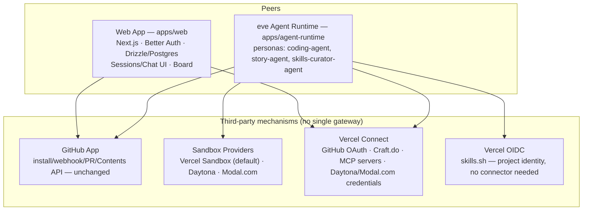

# Unified Agent Framework — Consolidation Plan

This document is the durable reference for consolidating four repositories
(`bl1nk-bot/open-agents`, `bl1nk-bot/bl1nk-studio-mcp`, `billlzzz18/agent-kanban`,
`bl1nk-bot/bl1nk-auth`) into a single framework built on this repo, using
Vercel's `eve` as the agent runtime and Vercel Connect for third-party
OAuth. It is the source of truth for the tracking issues filed against
each phase below.

## Repo scorecard

| Repo | Verdict | Key asset | Fatal flaw |
|---|---|---|---|
| **open-agents** | **Base** | Next.js 16 + Drizzle/Postgres (Neon) + Better Auth + Vercel Sandbox, GitHub App w/ webhooks + PR generation, ~104 tests + CI | No board/kanban view, single vertical, agent runtime hand-rolled on the Workflow SDK |
| **bl1nk-studio-mcp** | Donor — vertical + patterns | StoryGraph model + 11 granular MCP tools + exporters (mermaid/canvas/dashboard/markdown/csv) | 3 different bespoke OAuth/PKCE implementations, Notion sync is an unimplemented stub, HMAC webhook fail-open, desktop UI unwired, Vercel deploy permanently broken |
| **agent-kanban** | Donor — UI pattern only | Kanban UX for agent runs (status grouping, artifact/PR preview, filters) | No DB, no tests/CI, mid-broken Cursor→KiloCode SDK migration — does not run today |
| **bl1nk-auth** | Retire name, keep 1 tool | Despite the name, this is "Curator" — a skill-lifecycle governance tool, not an auth service | Rust crate does not compile (`lib.rs` misnamed, missing `tempfile` dep) |

## Target architecture

There is deliberately **no single integration gateway**. Each third party
uses the mechanism that fits it:

- **GitHub App** (unchanged) for installation-scoped repo access, webhooks,
  PR creation.
- **GitHub OAuth via Vercel Connect** as a second, lighter mechanism for
  cases that just need a user-scoped token without an installation.
- **Vercel Sandbox** as the default compute provider, accessed directly
  through `packages/sandbox`'s existing interface (hot path — an agent
  calls `exec`/`read`/`write` dozens of times per turn, so this must stay
  low-latency).
- **Vercel Connect** for every service that genuinely needs OAuth and has
  its own user accounts: Craft.do, external MCP servers, and credentials
  for alternate sandbox providers (Daytona, Modal.com).
- **Vercel OIDC** for skills.sh, which trusts Vercel project identity
  directly and needs no connector at all.

## Sandbox — multi-provider

`packages/sandbox/interface.ts` already defines the abstract contract
(`exec`, `readFile`/`writeFile`, `gitClone`/`gitBranch`, `snapshot`/`resume`,
`setGitHubAuthToken`) that `packages/sandbox/vercel/` implements today. That
interface is the extension point — add `packages/sandbox/daytona/` and
`packages/sandbox/modal/` as new implementations of the same contract. Users
connect a non-Vercel provider via a Vercel Connect connector
(`vercel connect create daytona`, `vercel connect create modal.com`) and pick
their provider on the Settings → Connections page; Vercel Sandbox stays the
zero-config default. eve's tools call the interface, never a specific
provider, so this is transparent to the agent.

## Vercel Connect — connectors to provision

| Connector | Replaces | Command |
|---|---|---|
| `craft.do` | Hand-rolled popup OAuth+PKCE in `studio-mcp/book` (`CraftAuthProvider.tsx`) | `vercel connect create craft.do --name craft` |
| `mcp.<server>` | `McpOAuthService` in `studio-mcp/support` (hand-rolled PKCE, token refresh was a TODO) | `vercel connect create mcp.<server> --name ...` |
| `github` (OAuth) | Nothing — additive alongside the existing GitHub App | `vercel connect create github --name github-oauth` |
| `daytona` / `modal.com` | New — credentials for alternate sandbox providers | `vercel connect create daytona` / `vercel connect create modal.com` |

Call shape: `getToken('oauth/craft', { subject: { type: 'user', id: userId }, scopes: [...] })`,
catching `UserAuthorizationRequiredError` and surfacing the consent URL via
`vercel.connect.createConnectorAuthorizationRequest`. Tokens a user already
approved under the old `McpOAuthService` can be migrated without forcing
re-auth via `POST /v1/connect/token/{connector}/import`.

## Auth consolidation

Better Auth (`apps/web/lib/auth/config.ts`) remains the single source of
truth for **user identity** — Vercel OAuth for sign-in, GitHub App OAuth for
repo access, unchanged. Vercel Connect is a separate concern: it holds the
tokens used to **talk to a third party on that user's behalf**. The three
bespoke OAuth/PKCE implementations found in `bl1nk-studio-mcp` (core's Exa
JWT/JWKS check, support's `McpOAuthService`, book's Craft popup) collapse
into Connect connectors; `bl1nk-auth`'s name is retired since it never
contained auth logic to begin with.

## Feature merge matrix

| Feature | Source | Destination | Treatment |
|---|---|---|---|
| Chat coding agent + Vercel Sandbox | open-agents | `apps/web` + eve persona `coding-agent` | adopt |
| Better Auth (Vercel + GitHub App) | open-agents | `apps/web/lib/auth` | adopt |
| GitHub App install/webhook/PR gen | open-agents | `apps/web/api/github/*` | adopt |
| Skills loader + lockfile | open-agents | `apps/web` + eve tool loader | adopt |
| Durable session execution + streaming | open-agents (hand-rolled Workflow SDK) | `apps/agent-runtime` — eve native session API | rebuild |
| StoryGraph model + 11 granular MCP tools | studio-mcp/core | eve persona `story-agent` | port |
| Mermaid/Canvas/Dashboard/Markdown/CSV exporters | studio-mcp/core | shared package, reused by story-agent + web download endpoints | port |
| Multi-view workspace (Editor/Graph/Timeline/Insights, List/Board/Table/Calendar/Heatmap) | studio-mcp/desktop + ide | new `apps/web` `/workspace` for story-agent | port (UX only — desktop's own components aren't wired to its `App.tsx`) |
| Agent-run Kanban board | agent-kanban | `apps/web` `/sessions` "Board" view, backed by eve `list_agent_runs` + existing GitHub PR data | port (UX only — the code doesn't run) |
| Mode-switching UX (support/code/plan/debug) | studio-mcp/support | chat UI mapped onto existing explorer/executor/design subagents | port |
| Skill staleness/backup/archive/merge governance | bl1nk-auth (Curator) | `skills-curator-agent` persona + admin page | port (rewritten in TS — the Rust crate doesn't compile) |
| Exa web research tool | studio-mcp/core | eve shared tool, any persona | port |
| Craft.do article workspace | studio-mcp/book | optional, via Vercel Connect | defer |
| GitHub → Notion sync | studio-mcp/sync | optional | drop-as-is (100% unimplemented stub today) |

## Rollout phases

### Phase 0 — Stabilize the base (open-agents)
- **0A** Turn on exfiltration defense (`api/sandbox/route.ts:247`, currently disabled pending a strategy)
- **0B** Fix the git-clone-into-nonempty-dir edge case (`packages/sandbox/vercel/sandbox.ts:578`)
- **0C** Fix the ~130ms skills-load bottleneck (`api/chat/_lib/runtime.ts:24`)

### Phase 1 — eve Agent Runtime + Vercel Connect + Sandbox providers (the main work)
- **1.0** Provision Vercel Connect connectors (`github`, `craft.do`, `mcp.<server>`, `daytona`/`modal.com`); add `daytona/` and `modal/` implementations to `packages/sandbox`
- **1A** Scaffold `apps/agent-runtime` via `npx eve@latest init`, wire into the turborepo/pnpm workspace, add a CI job
- **1B** Wrap the existing tool set as `defineTool`: bash/read/write/edit/grep/glob call `packages/sandbox` directly (hot path); tools touching Craft.do/MCP/GitHub OAuth call `@vercel/connect`'s `getToken()`; task/todo/skill/fetch/ask-user-question unchanged
- **1C** Define the `coding-agent` persona (`defineAgent`), porting model routing from `packages/agent/models.ts` (AI Gateway) and `system-prompt.ts`
- **1D** Spike the subagent pattern on eve (explorer/executor/design) — eve's docs don't describe subagents directly; determine whether nested sessions or separate `defineAgent`s calling each other via the session API is the right shape
- **1E** Wire the chat UI to eve's session API (`POST /eve/v1/session`, `GET /eve/v1/session/<id>/stream`), replacing the Workflow SDK call in `apps/web/app/workflows/chat.ts`
- **1F** Demote `workflowRuns`/`workflowRunSteps` to an index (session↔chat↔PR), no longer the source of truth for execution state — eve Agent Runs is
- **1G** Move sandbox lifecycle hooks (`sandbox-lifecycle.ts`, `sandbox-provisioning.ts`) to be called from eve tool functions
- **1H** Adapt the ~104 existing tests that target Workflow SDK internals to target the eve session API instead; CI must stay green

### Phase 2 — Board view (agent-kanban UX)
- **2A** Data source: eve `list_agent_runs` joined with existing GitHub PR data — no new data model needed
- **2B** List/Board toggle on `/sessions`, grouped by status/repo/date with filters (with-artifacts / PR / recently-active), built on open-agents' existing components
- **2C** Artifact preview reuses the existing `api/sessions/[sessionId]/{diff,files}` endpoints directly

### Phase 3 — Story vertical (studio-mcp/core)
- **3A** Move the StoryGraph schemas into a new `packages/story`
- **3B** Wrap the 11 granular tools as `defineTool` for the `story-agent` persona
- **3C** Move the exporters into a new `packages/exporters`, shared by the story-agent tools and a web download endpoint
- **3D** New `/workspace` page in `apps/web`, referencing the view concepts from desktop/ide but built fresh on Next.js

### Phase 4 (addon, after core infra) — Skills/Curator via skills.sh
Two skill tiers: **System Skills** (`.agents/skills/*/SKILL.md` + `skills-lock.json`, team-owned, edited via normal PR) and **User Skills**
(new `userSkills` table, account-scoped, user-managed). All three ingestion
sources — skills.sh, direct GitHub, or authored in-session — land in User
Skills only; promoting one to a System Skill still requires a normal PR.
Every install, from any source, is gated by the existing `ask-user-question`
tool with skills.sh audit results (when available) attached as context —
there is no separate approval queue or trust-tier system.

### Phase 5 (deferred) — Craft.do workspace + GitHub→Notion sync
Only build if there's real demand. Both require a Vercel Connect connection;
the Notion sync additionally requires implementing the Notion API calls
that `studio-mcp/sync` only stubs today.

## Known issues not to reintroduce

- `agent-kanban/src/lib/agents/server.ts` references `cursorSdk`,
  `MissingCursorApiKeyError`, `Cursor.me` with no matching import, and
  depends on `@cursor/sdk` which isn't in `package.json` — port the UX only,
  never the code.
- `studio-mcp/sync/src/index.ts` verifies HMAC signatures fail-open when no
  secret is set, and `fetchFileContent()` always returns an empty string —
  fix both before ever enabling this.
- `studio-mcp/desktop/App.tsx` is a skeleton not wired to its own real
  components (`CharacterCard`, `MermaidViewer`, `StoryTimeline`, etc.).
- `bl1nk-auth/mcp-server` does not compile (`libs.ms` should be `lib.rs`,
  `tempfile` missing from `Cargo.toml`) — rewrite in TypeScript, don't port
  the Rust.
- `studio-mcp`'s Vercel deploy is permanently broken from a stale
  `rootDirectory: packages/support-agent` — moot once open-agents' own
  deploy config is canonical.
- `studio-mcp/support`'s mode count disagrees between docs (4) and code (5,
  `AGENT_MODES`) — treat the code as the source of truth when porting.
